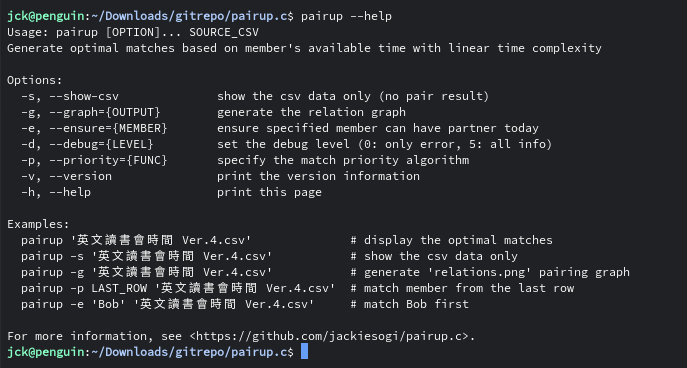
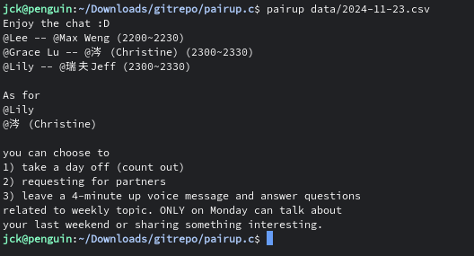
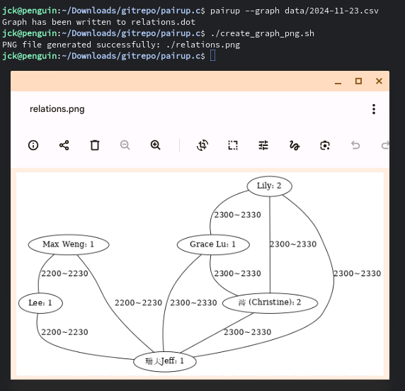

# pairup.c
This program provides a solution to help members in English study group to pair up with each other more efficiently by implementing several algorithms to prioritize the pairing order.



## Features
### Show the pair result



### Show the relation graph



## How to build (Ubuntu 22.04)

- Install the required packages.
```bash
sudo apt-get install build-essential make git cmake
```

- Clone the repository.
```bash
git clone https://github.com/jackiesogi/pairup.c.git
cd pairup.c
```

- Run `make` to build the program.
```bash
mkdir build
(mkdir -p build; cd build; cmake ..; make)
```

- Run `get-today-google-sheet.sh` to get the latest sheet (`pairup` will need the csv file it fetched).
```bash
./get-today-google-sheet.sh
```

- The main program `pairup` we built is located in project root.
```bash
./pairup --help
```
